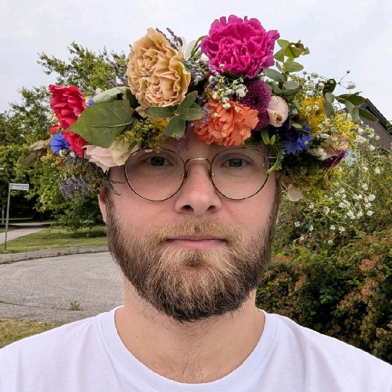

# Albin Åberg

  

    
  

  

	
📞 +46 72 174 19 12

	
✉️ albin.aberg@proton.me

	
🌐 <a href="https://www.linkedin.com/in/albin-hans-peter-aberg/">LinkedIn</a>
	

	
🌐 <a href="https://github.com/Lodjuret">Github</a>
	

  

---
## Education

#### Högskolan Kristianstad
**Bachelor Programme in Software Development**, 2014 - 2018 (Bachelor Exam unfinished)

**Selection of Classes**
- **Web Development**, ( C# )
- **Objectorientedprogramming**, ( Java )
- **Datacommuncation**
- **Database Technique**, ( MySQL )
- **Android App Development**, ( Android Studio, Java )

#### John Bauer Gymnasiet
**IT Programme**, 2010 - 2013

**Selection of Classes**
- **Programming A**, ( C# )
- **Programming B**, ( C# ) 
- **Basic Web Development**, ( HTML, CSS )

---
## Work Experience

#### ROI Rekrytering
**Fullstack Developer**, February 2023 - April 2025

Hired as a fullstack developer for their SaaS platform 'Workspace Recruit' which is a recruitment platform for all different kinds of companies and recruitment companies.

**Technologies used**
- Vue2
- Vue3
- Node.js
- Express.js
- MongoDB
- MySQL
- Git

**Attributes learned**
- Work as a team, both in discussion for a broader perspective and on each feature.
- How to function as a team and be open about issues.

#### AB Sydsten
**Software Developer**, 2019 - January 2023

My purpose at AB Sydsten was to handle support tickets and develop web apps. It ended up with a pretty broad role of support for general needs as well which gained me a lot of attributes while handing social needs. 

**Technology used**
- PHP
- SQL Server
- IIS Web Server
- Active Directory
- SVN
- JavaScript
- Bootstrap

**Attributes learned**
- Pedagogic way to explain issues and support tickets since we had a broad clientele of users 
- Self managing what tech stack to use and how to learn what is needed for each project

---
## Projects

#### Apex World
A table top role playing game that I'm creating for fun. The power system is inspired by the the book Lord of Mysteries and other novels I've read. Future of the project is to create a web app helper for handling combat and other niceties.

#### TreeBase
A project to handle recruitment of volunteers for non-profit organization and the communication with the volunteers. Currently in planning stage, since I ended up with creep scope while I started to code. So a need for a deeper plan is needed. Will try to handle the need of a broad list of organizations but is mostly for the use of Öland Roots which is a Swedish reggae festival. 

#### LoNix
This is my project for my computer which uses NixOS (LINUX), Home-manager, Flakes and more. NixOS is a declarative approach for managing your computer. So in a more lay mans term for example when installing apps and configuring them you can do so in code. I'm also using AGS to create my own shell, for example the task bar and application launcher. AGS is a middle hand to make it easier to interact with the shell systems. You write AGS code with Typescript.

---
## Skills

- Proficient in Vue.js, both Vue2 and Vue3.
- Proficient in Typescript and Javascript.
- Excellent communication skills and collaborative abilities. 
- Pedagogic towards clients and team members, which is something I learnt working with customer support.
- Proficient with NixOS, Flakes and Home-Manager. Declarative Operating System which means configuration files for declaring softwares and so on.
- Dabbled with Java, C#, Python, GO, and PHP. 
- Swedish drivers license type B.
---